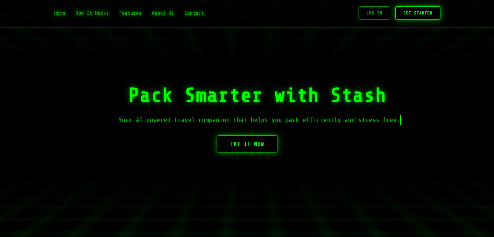
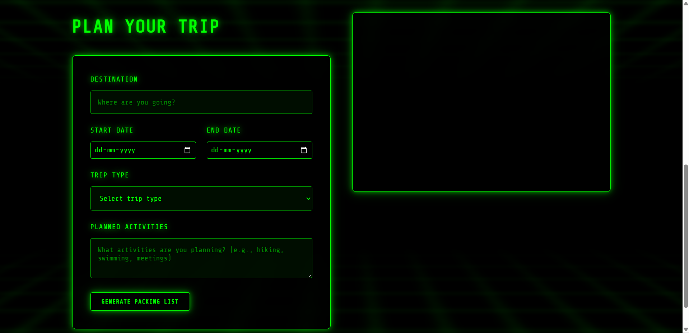

# Stash AI Packing Assistant 🧳

A modern, AI-powered travel companion that helps you pack efficiently and stress-free. Built with a sleek cyberpunk design and intelligent packing recommendations.

## Preview 🖼️

### Home Page


### AI Packing Interface


## Features ✨

- **AI-Powered Packing Lists**: Get personalized packing recommendations based on your destination, trip duration, and activities
- **Smart Trip Planning**: Input your trip details including destination, dates, and planned activities
- **Cyberpunk UI/UX**: Modern, responsive interface with a futuristic design
- **Offline Mode**: Fallback to local recommendations when AI service is unavailable
- **Real-time Updates**: Dynamic loading states and smooth animations

## Getting Started 🚀

### Prerequisites

Before running the application, make sure you have the following installed:
- [Node.js](https://nodejs.org/) (LTS version recommended)
- npm (comes with Node.js)

### Installation

1. Clone the repository:
```bash
git clone https://github.com/tabishfarhan7/stash-ai-packing.git
cd stash-ai-packing
```

2. Install server dependencies:
```bash
cd server
npm install
```

3. Create a `.env` file in the server directory:
```env
OPENAI_API_KEY=your_openai_api_key_here
PORT=3000
```

4. Start the server:
```bash
npm start
```

5. Open `index.html` in your browser to use the application

## Usage 📝

1. Click "Try It Now" to access the packing interface
2. Enter your trip details:
   - Destination
   - Start and end dates
   - Trip type (Business, Leisure, Adventure, etc.)
   - Planned activities
3. Click "Generate Packing List" to get your personalized recommendations

## Technology Stack 💻

- Frontend:
  - HTML5
  - CSS3 (with modern animations)
  - Vanilla JavaScript
  - Responsive Design
  
- Backend:
  - Node.js
  - Express.js
  - OpenAI API Integration
  - CORS enabled

## Contributing 🤝

1. Fork the repository
2. Create your feature branch (`git checkout -b feature/AmazingFeature`)
3. Commit your changes (`git commit -m 'Add some AmazingFeature'`)
4. Push to the branch (`git push origin feature/AmazingFeature`)
5. Open a Pull Request

## License 📄

This project is licensed under the MIT License - see the [LICENSE](LICENSE) file for details.

## Acknowledgments 🙏

- OpenAI for providing the AI capabilities
- The cyberpunk community for design inspiration
- All contributors who help improve this project

## Support 💬

For support, please open an issue in the GitHub repository or contact the maintainers.

---

Made with ❤️ by [Mohammad Tabish]
